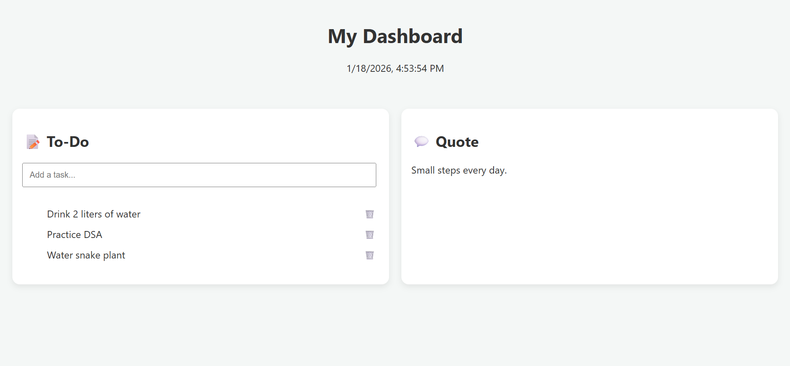

## Personal Productivity Dashboard 

A simple productivity dashboard built with vanilla HTML, CSS, and JavaScript.

🔗 Live Demo:
https://YOUR_GITHUB_USERNAME.github.io/productivity-dashboard/

 ✨ Features
- Live date & time
- To-do list (add, edit, delete)
- Persistent data using LocalStorage
- Responsive layout

🛠 Tech Stack:
HTML · CSS · JavaScript

🚀 Deployment:
Deployed on GitHub Pages

## 📸 Screenshots

